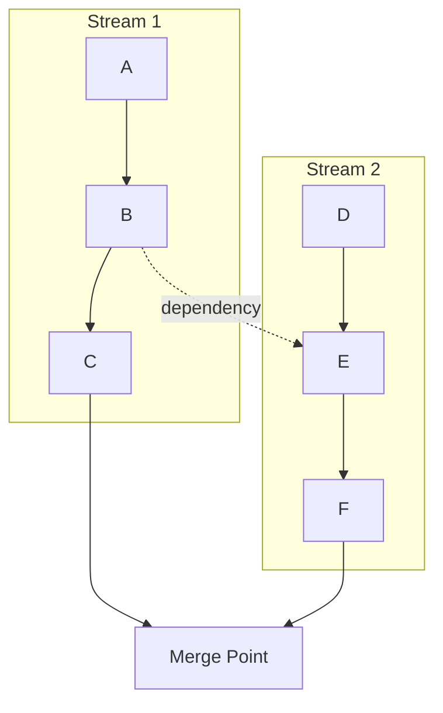
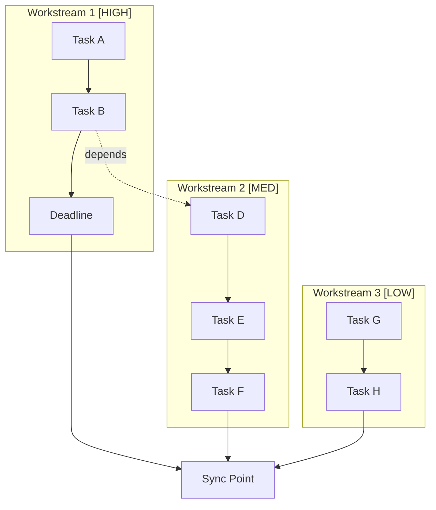
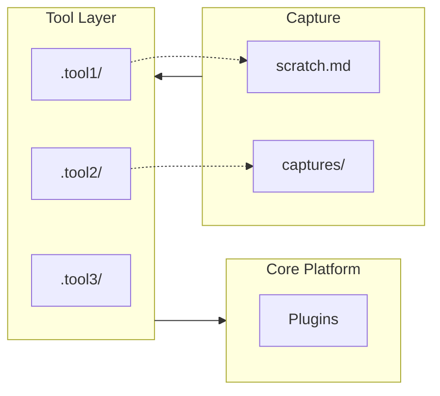
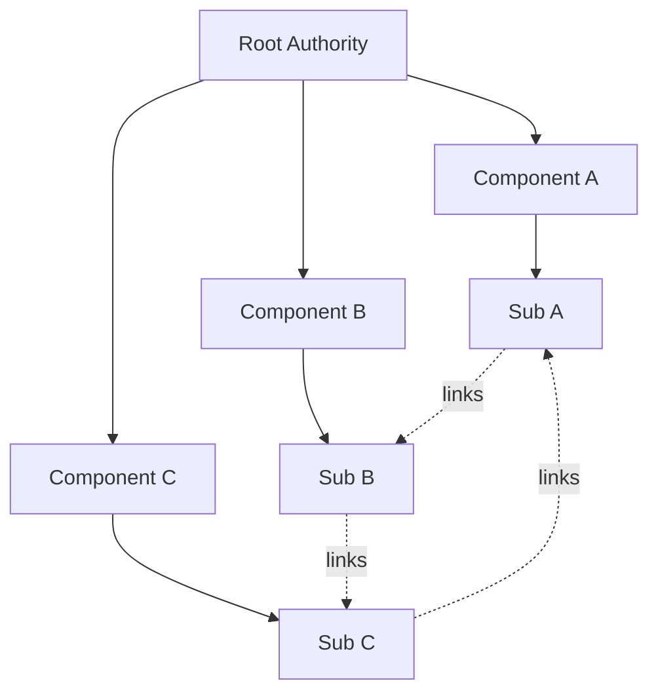

# /visualize - Project Architecture & Visualization Command

**Version:** 3.0 (Analysis Research Edition)
**Purpose:** Visual anchoring for complex research projects - visualize multi-sandbox architectures, dependencies, parallel workflows, and system integrations

## Core Principle: Anchoring Understanding

Every visualization anchors understanding to core principles and goals:
- **What** are the components and how do they link?
- **How** do parallel workstreams and sandboxes interact?
- **Why** do these dependencies exist?
- **Where** does this fit in the larger research pipeline?

## Usage

```
/visualize [TOPIC/PROJECT]
/visualize FOOD SECURITY PIPELINE mode:system focus:parallel
/visualize SANDBOX 03 mode:mermaid focus:dependencies anchor:"indicator calculation"
/visualize RESEARCH AREAS mode:matrix focus:links depth:full
```

**Project-Specific Examples:**

```
/visualize BELGRADE ARCHITECTURE
/visualize SANDBOXES mode:system focus:parallel depth:full
/visualize DATA PIPELINE mode:mermaid focus:dependencies
/visualize SURVEY UNDERSTANDING SANDBOX mode:ascii focus:flows
/visualize INDICATORS MODULE mode:ascii focus:parallel style:hand-drawable
```

## Input Parameters

| Parameter | Values | Default |
|-----------|--------|---------|
| `mode` | ascii, mermaid, cards, blocks, callouts, system, matrix | ascii |
| `focus` | dependencies, flows, hierarchy, decisions, parallel, links, tools, sandboxes | flows |
| `style` | detailed, simple, hand-drawable | detailed |
| `anchor` | Core principle/question to anchor to | Infer from topic |
| `depth` | summary, standard, full | standard |
| `output` | single, split (separate files) | single |

## Output Modes

### Mode: ASCII (default)

Anatomical-boxed diagrams optimized for Obsidian:

```text
┌────────────────────────────────┐
│  COMPONENT NAME                │
│  (description)                 │
│  Anchor: [core principle]      │
│  Links: [dependencies]         │
└────────────────────────────────┘
         │
         ▼
```

### Mode: Mermaid

Dynamic flowcharts with subgraphs for parallel workstreams:



### Mode: System

Full system architecture with layers, tools, and integrations:

```text
┌─────────────────────────────────────────────────────┐
│                    SYSTEM NAME                       │
│  ┌─────────────────────────────────────────────┐    │
│  │  LAYER 1: [Name]                            │    │
│  │  Components: A, B, C                        │    │
│  └─────────────────────────────────────────────┘    │
│                       │                              │
│  ┌─────────────────────────────────────────────┐    │
│  │  LAYER 2: [Name]                            │    │
│  │  ┌─────────┐  ┌─────────┐  ┌─────────┐     │    │
│  │  │ Worker1 │  │ Worker2 │  │ Worker3 │     │    │
│  │  │ [HIGH]  │  │  [MED]  │  │  [LOW]  │     │    │
│  │  └─────────┘  └─────────┘  └─────────┘     │    │
│  └─────────────────────────────────────────────┘    │
└─────────────────────────────────────────────────────┘
```

### Mode: Matrix

Dependency matrix showing relationships:

```markdown
| From → To | A | B | C | D |
|-----------|:-:|:-:|:-:|:-:|
| **A**     | - | ✓ | ○ | ○ |
| **B**     | ← | - | ✓ | ○ |
| **C**     | ○ | ← | - | ✓ |
| **D**     | ○ | ○ | ← | - |

Legend: ✓ depends on, ← depended by, ○ no dependency
```

### Mode: Cards

Column-based view for comparison and overview:

```markdown
| Component A | Component B | Component C |
|-------------|-------------|-------------|
| Description | Description | Description |
| Anchor: X   | Anchor: Y   | Anchor: Z   |
| Links: B, C | Links: A    | Links: A, B |
```

### Mode: Blocks

Nested callout structure for Obsidian:

```markdown
> [!info] MAIN COMPONENT
> Description and purpose
> **Links:** Component B, Component C
>
> > [!note] Sub-component 1
> > Details here
>
> > [!note] Sub-component 2
> > Details here
```

### Mode: Callouts

Inline notes throughout document structure:

```markdown
## Section Title

> [!anchor] Core Principle
> How this section connects to the main goal

Content here...

> [!link] Dependencies
> - Depends on: X, Y
> - Depended by: Z

> [!flow] Next Step
> Where this leads
```

## Focus Types

### Focus: Dependencies

Show what depends on what:
- Upstream dependencies (what this needs)
- Downstream dependents (what needs this)
- Circular dependencies (feedback loops)
- Optional vs required dependencies

### Focus: Parallel

Show concurrent workstreams:
- Independent work tracks
- Sync points where streams meet
- Priority levels (HIGH/MED/LOW)
- Deadlines and constraints

### Focus: Links

Show interconnections:
- File-to-file links
- Concept relationships
- Cross-references
- Bidirectional connections

### Focus: Tools

Show tool integrations:
- Which tools interact with which components
- Tool layers (capture, process, output)
- Configuration dependencies
- API connections

### Focus: Sandboxes (Analysis-Rsrch Specific)

Show sandbox architecture and sequential flow:
- All 4 sandbox stages and their features
- Sequential dependencies (S01→S02→S03→S04)
- Parallel opportunities within Sandbox 03
- Research area alignment to each sandbox
- Decision gates between sandboxes

## Generation Workflow for Analysis-Rsrch

### Step 1: Parse Input

Extract from user input:
- Topic/project name (e.g., "SANDBOX 03" or "FOOD SECURITY PIPELINE")
- Mode preference (ascii, mermaid, system, matrix)
- Focus area (sandboxes, dependencies, parallel, links, flows, tools)
- Anchoring principle
- Depth level (summary/standard/full)

### Step 2: Analyze Structure

For analysis-rsrch, identify:
- **Sandboxes** - 4 isolated workspaces with sequential dependencies
- **Features** - 29 total (4+7+12+6 distribution)
- **Research Areas** - 10 reference documentation guides
- **Dependencies** - S01→S02→S03→S04 main path, plus intra-S03 parallel
- **Parallel streams** - Food Security, Economics, Likert modules in Sandbox 03
- **Decision gates** - Validation points between sandboxes
- **Artifacts** - Codebook, clean data, indicators, thesis outputs

### Step 3: Map Relationships

For each sandbox:
- List all features with their IDs
- Show upstream dependencies
- List downstream dependents
- Note parallel peers within sandbox
- Mark research area connections
- Document output artifacts
- Identify decision gates

### Step 4: Determine Anchoring

For each element:
- How it connects to thesis goal (end-to-end food security analysis)
- What principle it embodies (Foundation/Infrastructure/Analysis/Output)
- Why it exists in the structure
- What breaks if removed

### Step 5: Generate Visualizations

Based on mode and focus:

**For Sandboxes Focus:**
- Layer diagram showing all 4 sandboxes
- Sequential flow 01→02→03→04
- Feature count per sandbox
- Research area alignment

**For Dependencies Focus:**
- Mermaid graph with all features
- Matrix showing relationships
- Critical path highlighting
- Bottleneck identification

**For Parallel Focus:**
- Workstream diagram (S03 modules)
- Sync points visualization
- Priority markers [FOUNDATION]/[INFRA]/[ANALYSIS]/[OUTPUT]
- Parallelization opportunities

### Step 6: Create Hand-Drawable Version

Always include simplified version:
- 4 sandboxes in sequence with arrows
- Feature counts marked on each box
- Parallel modules inside Sandbox 03
- Decision gates where validation happens
- Can be sketched in 5 minutes

### Step 7: Add Insights & Usage

Include:
- Core principle statement
- Multi-sandbox dependencies
- Parallel processing notes
- Research area connections
- How to use for feature planning

## Output Structure

```markdown
# [Visualization Title]

## Anchoring Principle

> [!anchor] Core Question/Goal
> [The central principle this visualization anchors to]

## Overview

[1-2 sentences: what this shows and why it matters]

## System Architecture

[Primary diagram - full system view with layers]

## Parallel Workstreams

[Diagram showing concurrent work tracks with priorities]

## Dependencies & Links

[Mermaid or matrix showing relationships]

## Tool Integration Layer

[Diagram showing tool connections]

## Hand-Drawable Version

For sketching on paper (5 min):

[Simplified version preserving:
- Governance hierarchy
- Parallel workers
- Capture layer
- Tool integrations]

## Component Legend

| Symbol | Meaning |
|--------|---------|
| ┌──┐   | Defined component |
| [ ]   | Fuzzy/conceptual area |
| →     | Flow/dependency |
| -.->  | Weak/optional dependency |
| ←     | Feedback loop |
| ═══   | Layer boundary |
| [HIGH] | Priority marker |

## Dependency Matrix

[Table showing From → To relationships]

## Key Insights

- [What the structure reveals about dependencies]
- [How parallel workstreams interact]
- [Critical path and bottlenecks]
- [Tool integration patterns]

## How to Use This

1. **Follow governance arrows** - Dependencies flow from root authority down
2. **Check sync points** - Where parallel streams must coordinate
3. **Respect priorities** - HIGH priority workstreams have constraints
4. **Use appropriate tools** - Each layer has designated integrations
5. **Update as work progresses** - Keep streams current
```

## Advanced Features

### Parallel Workstream Visualization

```text
┌─────────────────────────────────────────────────────────────────┐
│                    PARALLEL WORKSTREAM ARCHITECTURE              │
│                                                                  │
│  TIME ──────────────────────────────────────────────────────▶   │
│                                                                  │
│  ┌─────────────────────────────────────────────────────────┐    │
│  │ WORKSTREAM 1: [NAME]                        [PRIORITY]   │    │
│  │                                                          │    │
│  │  Task A ──→ Task B ──→ Task C ──→ DEADLINE              │    │
│  └─────────────────────────────────────────────────────────┘    │
│         │           │           │                                │
│         │ DEPENDS   │ INFORMS   │ PRODUCES                      │
│         ▼           ▼           ▼                                │
│  ┌─────────────────────────────────────────────────────────┐    │
│  │ WORKSTREAM 2: [NAME]                        [PRIORITY]   │    │
│  │                                                          │    │
│  │  Task D ──→ Task E ──→ Task F                           │    │
│  └─────────────────────────────────────────────────────────┘    │
│                                                                  │
│  SYNC POINTS: ═══════════════════════════════════════════════   │
│                          │                                       │
│                          ▼                                       │
│                   [MERGE/VALIDATE]                               │
└─────────────────────────────────────────────────────────────────┘
```

### Tool Integration Layer

```text
┌─────────────────────────────────────────────────────────────────┐
│                      TOOL INTEGRATION LAYER                      │
│                                                                  │
│      ┌─────────────────────────────────────────────────────┐    │
│      │                   CORE PLATFORM                      │    │
│      │   .obsidian/plugins/ ←─────────────────────────┐    │    │
│      │         │                                       │    │    │
│      │         ▼                                       │    │    │
│      │   ┌─────────┐  ┌─────────┐  ┌─────────┐       │    │    │
│      │   │ Plugin1 │  │ Plugin2 │  │ Plugin3 │       │    │    │
│      │   └────┬────┘  └────┬────┘  └────┬────┘       │    │    │
│      │        └────────────┴────────────┘            │    │    │
│      └─────────────────────────────────────────────────────┘    │
│                              │                                   │
│  ┌───────────┬───────────────┼───────────────┬──────────────┐   │
│  │           │               │               │              │   │
│  │           ▼               ▼               ▼              │   │
│  │  ┌─────────────┐  ┌─────────────┐  ┌─────────────┐      │   │
│  │  │   .tool1/   │  │   .tool2/   │  │   .tool3/   │      │   │
│  │  │   agents/   │  │   commands/ │  │   prompts/  │      │   │
│  │  │   commands/ │  │             │  │   (N tools) │      │   │
│  │  └──────┬──────┘  └──────┬──────┘  └──────┬──────┘      │   │
│  │         └────────────────┴────────────────┘              │   │
│  └──────────────────────────────────────────────────────────┘   │
└─────────────────────────────────────────────────────────────────┘
```

### Linked Notes Network

```text
┌─────────────────────────────────────────────────────────────────┐
│                      LINKED NOTES NETWORK                        │
│                                                                  │
│                    ┌──────────────────────┐                     │
│                    │   ROOT AUTHORITY     │                     │
│                    │   (Governance Doc)   │                     │
│                    └──────────┬───────────┘                     │
│               ┌───────────────┼───────────────┐                 │
│               │               │               │                 │
│               ▼               ▼               ▼                 │
│    ┌──────────────┐  ┌──────────────┐  ┌──────────────┐        │
│    │   Child 1    │  │   Child 2    │  │   Child 3    │        │
│    │  (Context)   │  │  (Standards) │  │   (Rules)    │        │
│    └──────┬───────┘  └──────┬───────┘  └──────┬───────┘        │
│           │                 │                 │                 │
│    ┌──────┴─────┐    ┌──────┴──────┐   ┌─────┴─────┐           │
│    │            │    │             │   │           │           │
│    ▼            ▼    ▼             ▼   ▼           ▼           │
│ [Grandchild] [GC]  [GC]         [GC] [GC]       [GC]           │
│                                                                  │
│  ═══════════════════════════════════════════════════════════    │
│                              │                                   │
│              ┌───────────────┼───────────────┐                  │
│              │               │               │                  │
│              ▼               ▼               ▼                  │
│       ┌───────────┐   ┌───────────┐   ┌───────────┐            │
│       │  Stream 1 │◄─►│  Stream 2 │◄─►│  Stream 3 │            │
│       └───────────┘   └───────────┘   └───────────┘            │
│                              │                                   │
│                              ▼                                   │
│                    ┌──────────────────┐                         │
│                    │     ARCHIVE      │                         │
│                    └──────────────────┘                         │
└─────────────────────────────────────────────────────────────────┘
```

## Mermaid Templates

### Parallel Workstreams



### Tool Integration



### Dependency Graph



## Hand-Drawable Simplification Rules

1. **Governance at top** - Root authority flows down
2. **Parallel workers middle** - Show with priority markers
3. **Capture at bottom** - Input sources
4. **Tool layer on side** - Cross-cutting integrations
5. **5-7 elements max** - Essence only
6. **Simple symbols** - Boxes, arrows, labels
7. **Priority visible** - [HIGH] [MED] [LOW] markers
8. **Sync points marked** - Where streams converge

**Template:**

```text
        ┌─────────────────────┐
        │   ROOT AUTHORITY    │
        └──────────┬──────────┘
     ┌─────────────┼─────────────┐
     ▼             ▼             ▼
  CHILD 1      CHILD 2      CHILD 3
     │             │             │
     └─────────────┴─────────────┘
                   │
═══════════════════╪═══════════════════
PARALLEL WORKERS   │
═══════════════════╪═══════════════════
     │             │             │
┌────▼────┐   ┌────▼────┐   ┌────▼────┐
│ WORKER1 │   │ WORKER2 │   │ WORKER3 │
│ [HIGH]  │   │  [MED]  │   │  [LOW]  │
└────┬────┘   └────┬────┘   └────┬────┘
     └─────────────┴─────────────┘
                   │
═══════════════════╪═══════════════════
CAPTURE INPUT      │
═══════════════════╪═══════════════════
     │             │             │
 source 1      source 2     source 3

═══════════════════╪═══════════════════
TOOL LAYER         │
═══════════════════╪═══════════════════
  tool1         tool2        tool3
```

## Integration Notes

**Obsidian:**
- Copy-paste directly into notes
- Mermaid renders automatically
- Link with `[[visualization-name]]`
- Embed with `![[visualization-name]]`

**File naming:**
- `{topic-slug}-{mode}-{focus}.md`
- Examples: `inbox-system-parallel.md`, `thesis-mermaid-dependencies.md`

**Suggested locations:**
- `inbox/projects/visualizations/`
- `workbench/projects/*/figures/`
- Dedicated `Visualizations/` folder in vault

## Related Commands

- `/diagram` - Anatomical-boxed ASCII diagrams (simpler)
- `/workbench` - Project workspace management
- `/inbox` - Quick capture

## Quick Reference for Analysis-Rsrch

```
# Basic overview of entire project
/visualize BELGRADE ARCHITECTURE

# System architecture with all 4 sandboxes
/visualize MULTI-SANDBOX mode:system focus:sandboxes

# Parallel opportunities in Sandbox 03
/visualize INDICATORS mode:ascii focus:parallel

# All 29 features and their dependencies
/visualize PIPELINE mode:mermaid focus:dependencies depth:full

# Sandbox-to-research-area mapping
/visualize SANDBOXES mode:matrix focus:links

# Hand-drawable quick view (5 min sketch)
/visualize QUICK OVERVIEW style:hand-drawable

# Specific sandbox details
/visualize SANDBOX 01 mode:ascii
/visualize SANDBOX 02 mode:system focus:flows
/visualize SANDBOX 03 mode:mermaid focus:parallel
/visualize SANDBOX 04 mode:ascii focus:dependencies

# Research area alignment across all sandboxes
/visualize RESEARCH AREAS mode:cards

# Feature distribution and dependencies
/visualize FEATURES mode:matrix focus:dependencies

# Data flow through pipeline
/visualize DATA FLOW mode:ascii focus:flows

# Complete architecture with all details
/visualize FOOD SECURITY ANALYSIS mode:system focus:sandboxes depth:full
```

---

## Integration with Project Documentation

**Reference in outputs:**
- `readme.txt` - Detailed setup guide, WHERE TO START, WHAT TO DO
- `PIPELINE.md` - Comprehensive architecture diagrams with Mermaid + hand-drawable
- `ARCHITECTURE.md` - Original multi-sandbox design document
- `research-areas/00-index.md` - Navigation for all 10 reference areas
- `sandboxes/*/SANDBOX.md` - Per-sandbox entry points and success criteria

**Related Project Docs:**
- `CLAUDE.md` - Agent-foreman integration instructions
- `CONTEXT.md` - Project overview and goals
- `SPECIFICATION.md` - Detailed requirements
- `.migration-backup/` - Pre-migration backup (safety net)

---

*Last updated: 2025-12-11*
*Adapted for: Analysis Research - Vietnamese Household Food Security Survey*
*Multi-Sandbox Architecture: 4 sandboxes, 29 features, 10 research areas*
