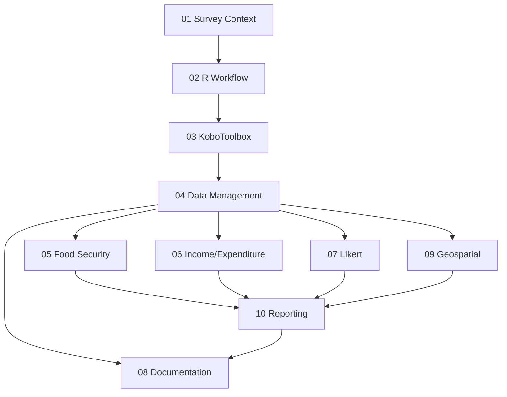

# Research Areas Index

Master navigation for Vietnam Food Security Survey analysis research documentation.

---

## Quick Navigation

| # | Area | Purpose | Agent-Foreman Features |
|---|------|---------|------------------------|
| 01 | [Survey Context](01-survey-context/) | Understanding survey meaning & Vietnam context | — |
| 02 | [R Workflow](02-r-workflow/) | R packages & survey analysis setup | `core.*` |
| 03 | [KoboToolbox](03-kobo-xlsform/) | XLSForm structure & data import | `data-import.*` |
| 04 | [Data Management](04-data-management/) | Cleaning, versions, missingness | `data-cleaning.*` |
| 05 | [Food Security Indicators](05-food-security-indicators/) | HDDS, FIES, FCS, rCSI calculation | `indicators.*` |
| 06 | [Income & Expenditure](06-income-expenditure/) | Economic indicators, poverty analysis | `economics.*` |
| 07 | [Likert & Psychometrics](07-likert-psychometrics/) | Scale reliability, visualization | `likert.*` |
| 08 | [Documentation Standards](08-documentation-standards/) | Codebooks, data dictionaries | `documentation.*` |
| 09 | [Geospatial](09-geospatial/) | Maps, spatial analysis | `geospatial.*` |
| 10 | [Reporting](10-reporting/) | Tables, export to Word | `reporting.*` |

---

## Workflow Order



**Recommended Sequence:**
1. **01-Survey Context** → Understand what you're analyzing
2. **02-R Workflow** → Set up environment
3. **03-KoboToolbox** → Import data correctly
4. **04-Data Management** → Clean and merge versions
5. **05-07** (parallel) → Calculate indicators
6. **08-Documentation** → Create codebook
7. **09-Geospatial** → Create maps
8. **10-Reporting** → Generate thesis tables

---

## Cross-Cutting Topics

| Topic | Appears In | Notes |
|-------|------------|-------|
| Survey weighting | 02, 05, 09, 10 | Always use `srvyr` functions |
| Missing data | 03, 04, 08 | Distinguish structural vs non-response |
| Vietnam context | 01, 05, 06, 09 | Poverty lines, food patterns |
| Variable labels | 02, 08, 10 | Use `labelled` package |
| Export to Word | 10 | Use `flextable`, not `kableExtra` |

---

## Executable Components

### Scripts (R)

| Location | Script | Purpose |
|----------|--------|---------|
| 02-r-workflow/scripts/ | `setup-packages.R` | Install all packages |
| 02-r-workflow/templates/ | `analysis-script-template.R` | Standard script structure |
| 05-food-security/scripts/ | `calculate-hdds.R` | HDDS calculation |
| 05-food-security/scripts/ | `calculate-fcs.R` | FCS calculation |
| 05-food-security/scripts/ | `calculate-rcsi.R` | rCSI calculation |
| 07-likert/scripts/ | `reliability-analysis.R` | Cronbach's alpha |
| 09-geospatial/scripts/ | `choropleth-map-template.R` | Map generation |
| 10-reporting/templates/ | `gtsummary-table-template.R` | Table templates |

### Templates (Markdown)

| Location | Template | Purpose |
|----------|----------|---------|
| 01-survey-context/templates/ | `construct-mapping-template.md` | Map constructs to questions |
| 08-documentation/templates/ | `codebook-template.md` | Variable documentation |

### Checklists

| Location | Checklist | Purpose |
|----------|-----------|---------|
| 01-survey-context/checklists/ | `survey-review-checklist.md` | Pre-analysis review |

---

## Key Resources

### Primary Reference
- [Tidy Survey Book](https://tidy-survey-r.github.io/tidy-survey-book/) - Comprehensive R survey analysis guide

### Food Security Indicators
- [FANTA HDDS Guide](https://www.fantaproject.org/monitoring-and-evaluation/household-dietary-diversity-score)
- [FAO FIES Documentation](https://www.fao.org/measuring-hunger/)
- [WFP FCS Metadata](https://www.wfp.org/publications/meta-data-food-consumption-score-fcs-indicator)
- [FSCluster Handbook](https://fscluster.org/handbook/)

### Vietnam Context
- [GSO VHLSS 2022](https://www.gso.gov.vn/en/default/2024/04/results-of-the-viet-nam-household-living-standards-survey-2022/)
- [UNU-WIDER VARHS Data](https://www.wider.unu.edu/database/viet-nam-data)
- [World Bank Vietnam Poverty](https://documents.worldbank.org/curated/en/923881468303855779/)

### R Packages
- [gtsummary](https://www.danieldsjoberg.com/gtsummary/) - Tables
- [srvyr](https://github.com/gergness/srvyr) - Tidyverse survey analysis
- [sf](https://r-spatial.github.io/sf/) - Spatial data
- [robotoolbox](https://dickoa.gitlab.io/robotoolbox/) - KoboToolbox API

---

## Getting Started

### First Time Setup
```r
# Run from 02-r-workflow/scripts/
source("setup-packages.R")

# Initialize renv
renv::init()
```

### Daily Workflow
1. Open RStudio Project
2. Load packages: `library(tidyverse); library(srvyr)`
3. Load data: `data <- readRDS("data/processed/survey_clean.rds")`
4. Reference relevant area README for guidance
5. Use scripts/templates as starting points

### Before Submitting Thesis
- [ ] All analyses use survey weights
- [ ] Codebook complete with all variables
- [ ] Tables exported via flextable to Word
- [ ] Maps include scale bar and legend
- [ ] Methods section documents all transformations

---

## File Structure

```
research-areas/
├── 00-index.md                           # You are here
├── 01-survey-context/
│   ├── README.md                         # Best practices guide
│   ├── area-0-survey-context-understanding.md
│   ├── checklists/
│   │   └── survey-review-checklist.md
│   └── templates/
│       └── construct-mapping-template.md
├── 02-r-workflow/
│   ├── README.md
│   ├── area-1-r-workflow-survey-analysis.md
│   ├── scripts/
│   │   └── setup-packages.R
│   └── templates/
│       └── analysis-script-template.R
├── 03-kobo-xlsform/
│   ├── README.md
│   ├── area-2-kobo-xlsform-structure.md
│   └── templates/
├── 04-data-management/
│   ├── README.md
│   ├── area-3-raw-data-management.md
│   └── templates/
├── 05-food-security-indicators/
│   ├── README.md
│   ├── area-4-food-security-indicators.md
│   ├── scripts/
│   │   ├── calculate-hdds.R
│   │   ├── calculate-fcs.R
│   │   └── calculate-rcsi.R
│   └── templates/
├── 06-income-expenditure/
│   ├── README.md
│   ├── area-5-income-expenditure-vietnam.md
│   └── templates/
├── 07-likert-psychometrics/
│   ├── README.md
│   ├── area-6-likert-scales-psychometrics.md
│   └── scripts/
│       └── reliability-analysis.R
├── 08-documentation-standards/
│   ├── README.md
│   ├── area-7-documentation-standards.md
│   └── templates/
│       └── codebook-template.md
├── 09-geospatial/
│   ├── README.md
│   ├── area-8-geospatial-analysis.md
│   └── scripts/
│       └── choropleth-map-template.R
└── 10-reporting/
    ├── README.md
    ├── area-9-descriptives-reporting.md
    └── templates/
        └── gtsummary-table-template.R
```

---

*Last updated: 2025-12-10*
