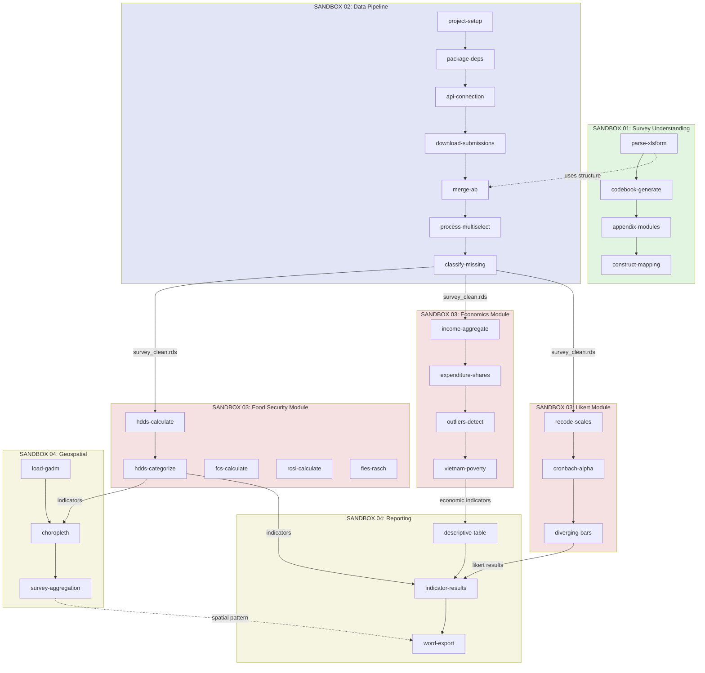

# Food Security Survey Analysis Pipeline (Multi-Sandbox)

## Anchoring Principle

> **Core Question:** How do we systematically transform Vietnamese household survey data into validated food security indicators for thesis research?

## Overview

This visualization shows the complete analysis workflow organized as 4 independent sandboxes with clear sequential dependencies and decision gates. The architecture isolates work areas while maintaining transparent data flow from raw KoBoToolbox survey data through validated indicators to thesis-ready outputs.

---

## System Architecture

```text
┌────────────────────────────────────────────────────────────────────────────────┐
│                    FOOD SECURITY ANALYSIS PIPELINE                              │
│                         Multi-Sandbox Architecture                              │
│                                                                                 │
│  [ RAW DATA INPUTS ]                                                            │
│   KoBoToolbox API  ←──  XLSForm Structure  ←──  Survey Versions A/B            │
│                         (research-areas/01-03)                                  │
│                              │                                                  │
│                              ▼                                                  │
│  ╔════════════════════════════════════════════════════════════════════════╗   │
│  ║  SANDBOX 01: SURVEY UNDERSTANDING (Foundation)         [4 features]    ║   │
│  ║  ┌──────────────────────────────────────────────────────────────────┐  ║   │
│  ║  │ XLSForm Parse → Codebook → Module Docs → Construct Mapping       │  ║   │
│  ║  │                                                                   │  ║   │
│  ║  │ Outputs: codebook.csv, construct_map.csv, survey_modules.md     │  ║   │
│  ║  │                                                                   │  ║   │
│  ║  │ Decision: Survey structure documented? ✓                        │  ║   │
│  ║  └──────────────────────────────────────────────────────────────────┘  ║   │
│  ║  Research Areas: 01-survey-context, 03-kobo-xlsform, 08-documentation  ║   │
│  ╚════════════════════════════════════════════════════════════════════════╝   │
│                              │                                                  │
│                              ▼                                                  │
│  ╔════════════════════════════════════════════════════════════════════════╗   │
│  ║  SANDBOX 02: DATA PIPELINE (Infrastructure)          [7 features]     ║   │
│  ║  ┌──────────────────────────────────────────────────────────────────┐  ║   │
│  ║  │ Setup          Download      Merge        Process       Classify  │  ║   │
│  ║  │ R project  →   KoBo data  →  A/B vers  →  multi-sel  →  missing  │  ║   │
│  ║  │ + renv         + API auth     + harmonize   + labels    + classify │  ║   │
│  ║  │                                                                   │  ║   │
│  ║  │ Output: data/processed/survey_clean.rds                           │  ║   │
│  ║  │                                                                   │  ║   │
│  ║  │ Decision: Clean data validated? ← If not, loop to cleaning       │  ║   │
│  ║  └──────────────────────────────────────────────────────────────────┘  ║   │
│  ║  Research Areas: 02-r-workflow, 04-data-management                      ║   │
│  ╚════════════════════════════════════════════════════════════════════════╝   │
│                              │                                                  │
│                              ▼                                                  │
│  ╔════════════════════════════════════════════════════════════════════════╗   │
│  ║  SANDBOX 03: INDICATORS (Core Analysis)              [12 features]    ║   │
│  ║  ┌──────────────────────────────────────────────────────────────────┐  ║   │
│  ║  │  FOOD SECURITY (5)         ECONOMICS (4)        LIKERT (3)       │  ║   │
│  ║  │  ┌─────────────────┐       ┌──────────────┐    ┌──────────────┐ │  ║   │
│  ║  │  │ HDDS calc/cat   │       │ Income agg   │    │ Recode/alpha │ │  ║   │
│  ║  │  │ FCS (WFP)       │       │ Expend share │    │ Diverging viz│ │  ║   │
│  ║  │  │ rCSI (IPC)      │       │ Outliers (w) │    │ (likert pkg) │ │  ║   │
│  ║  │  │ FIES (Rasch)    │       │ Vietnam pov  │    │              │ │  ║   │
│  ║  │  │ (FAO, WFP, SDG) │       │ (VND ctx)    │    │ (psych)      │ │  ║   │
│  ║  │  └─────────────────┘       └──────────────┘    └──────────────┘ │  ║   │
│  ║  │                                                                   │  ║   │
│  ║  │ Output: output/survey_with_indicators.rds                         │  ║   │
│  ║  │ (Parallelization hint: All 3 modules can run simultaneously)     │  ║   │
│  ║  │                                                                   │  ║   │
│  ║  │ Decision: Indicators valid? ← If methodology issues, review      │  ║   │
│  ║  └──────────────────────────────────────────────────────────────────┘  ║   │
│  ║  Research Areas: 05-food-security, 06-income-expenditure, 07-likert     ║   │
│  ╚════════════════════════════════════════════════════════════════════════╝   │
│                              │                                                  │
│                              ▼                                                  │
│  ╔════════════════════════════════════════════════════════════════════════╗   │
│  ║  SANDBOX 04: ANALYSIS & REPORTING (Output)           [6 features]     ║   │
│  ║  ┌──────────────────────────────────────────────────────────────────┐  ║   │
│  ║  │  GEOSPATIAL (3)             REPORTING (3)                        │  ║   │
│  ║  │  ┌──────────────────┐       ┌──────────────────┐               │  ║   │
│  ║  │  │ GADM Vietnam     │       │ Table 1 (demos)  │               │  ║   │
│  ║  │  │ Choropleth maps  │       │ Indicator tables │               │  ║   │
│  ║  │  │ Survey-weighted  │       │ Word export      │               │  ║   │
│  ║  │  │ (tmap, sf, srvyr)│       │ (gtsummary,      │               │  ║   │
│  ║  │  │                  │       │  flextable)      │               │  ║   │
│  ║  │  └──────────────────┘       └──────────────────┘               │  ║   │
│  ║  │                                                                   │  ║   │
│  ║  │ Output: output/figures/, output/tables/                          │  ║   │
│  ║  │                                                                   │  ║   │
│  ║  │ Decision: Thesis-ready? ← If not, refine visuals/tables         │  ║   │
│  ║  └──────────────────────────────────────────────────────────────────┘  ║   │
│  ║  Research Areas: 09-geospatial, 10-reporting                           ║   │
│  ║  Plus: 08-documentation (codebook, appendix finalization)             ║   │
│  ╚════════════════════════════════════════════════════════════════════════╝   │
│                              │                                                  │
│                              ▼                                                  │
│  ┌──────────────────────────────────────────────────────────────────────────┐  │
│  │  DOCUMENTATION LAYER (concurrent with Sandbox 04)                        │  │
│  │  ┌──────────────┐  ┌──────────────┐  ┌──────────────┐                   │  │
│  │  │ Codebook     │  │ Appendix     │  │ Construct    │                   │  │
│  │  │ (auto-gen)   │  │ survey mods  │  │ mapping      │                   │  │
│  │  └──────────────┘  └──────────────┘  └──────────────┘                   │  │
│  └──────────────────────────────────────────────────────────────────────────┘  │
│                              │                                                  │
│                              ▼                                                  │
│  [ THESIS OUTPUTS ]                                                             │
│   figures/ ←─ tables/ ←─ documentation/                                         │
│   (choropleth maps, indicator summary, sample descriptives)                     │
└────────────────────────────────────────────────────────────────────────────────┘
```

---

## Feature Flow by Sandbox

### Sandbox 01: Survey Understanding (4 features)

```
XLSForm Structure
    │
    ├──→ Parse Structure (capture skip logic, form groups)
    │
    ├──→ Generate Codebook (variable names, labels, types, codes)
    │
    ├──→ Document Survey Modules (for thesis appendix)
    │
    └──→ Create Construct Mapping (HDDS → questions, FIES → questions, etc.)

         Output: Used by all downstream sandboxes
```

**Research Areas:** 01 (context), 03 (XLSForm), 08 (documentation)

---

### Sandbox 02: Data Pipeline (7 features)

```
Setup R Project
    │
    ├──→ Project structure + renv
    │
    └──→ Install packages (survey, srvyr, robotoolbox, sf, gtsummary)

         │
         ▼

KoBo Connection
    │
    ├──→ API authentication (robotoolbox)
    │
    └──→ Download submissions (with select_multiple handling)

         │
         ▼

Parse XLSForm (from structure)
    │
    └──→ Map choices, understand skip logic

         │
         ▼

Data Cleaning
    │
    ├──→ Merge versions A & B (structural NA for food waste in A)
    │
    ├──→ Process multi-select (wide → long, binary indicators)
    │
    └──→ Classify missing (structural vs non-response vs error)

         Output: survey_clean.rds (analysis-ready)
         │
         Decision Point: Validate quality before proceeding
```

**Research Areas:** 02 (R workflow), 04 (data management)

---

### Sandbox 03: Indicators (12 features - LARGEST)

Three parallel modules after cleaning:

```
Survey Clean Data
    │
    ├─────────────────────┬─────────────────────┬──────────────────┐
    │                     │                     │                  │
    ▼                     ▼                     ▼                  ▼

Food Security (5)     Economics (4)         Likert (3)       (can parallelize)
├─ HDDS calc          ├─ Income agg         ├─ Recode
├─ HDDS categorize    ├─ Expenditure share  ├─ Cronbach α
├─ FCS (WFP)          ├─ Outliers           └─ Diverging viz
├─ rCSI (IPC)         └─ Vietnam poverty
└─ FIES (Rasch)

    Output: survey_with_indicators.rds
    │
    Decision Point: Validate indicator distributions and internal consistency
```

**Research Areas:** 05 (food security), 06 (economics), 07 (Likert)

---

### Sandbox 04: Analysis & Reporting (6 features)

```
Indicators Ready
    │
    ├──────────────────────────────────┬──────────────────────────────────┐
    │                                  │                                  │
    ▼                                  ▼                                  ▼

Geospatial (3)                    Reporting (3)              Documentation
├─ Load GADM Vietnam              ├─ Table 1 (sample chars) ├─ Finalize codebook
├─ Choropleth maps                ├─ Indicator results      ├─ Construct appendix
└─ Survey-weighted agg            └─ Word export            └─ Methods section
    (by province)                      (flextable)

    Output: figures/, tables/
    │
    Final Output: Thesis-ready figures, tables, documentation
```

**Research Areas:** 09 (geospatial), 10 (reporting), 08 (documentation)

---

## Mermaid Dependency Graph



---

## Hand-Drawable Version (5 min sketch)

```text
                    ┌──────────────────┐
                    │ THESIS RESEARCH  │
                    │ Food Security    │
                    └────────┬─────────┘
                             │
    ╔════════════════════════╪════════════════════════╗
    ║ SANDBOX 01: SURVEY UNDERSTANDING (Foundation)  ║
    ║ Parse XLSForm → Codebook → Mapping              ║
    ║ Output: Documentation for all downstream        ║
    ╚════════════════════════╪════════════════════════╝
                             │
    ╔════════════════════════╪════════════════════════╗
    ║ SANDBOX 02: DATA PIPELINE (Infrastructure)     ║
    ║ R setup → KoBo API → Clean → Merge A/B          ║
    ║ Output: survey_clean.rds                        ║
    ╚════════════════════════╪════════════════════════╝
                             │
    ╔════════════════════════╪════════════════════════╗
    ║ SANDBOX 03: INDICATORS (parallel possible)      ║
    ║      │            │             │               ║
    ║    HDDS        ECONOMICS      LIKERT            ║
    ║     FCS         Income        Scales            ║
    ║    rCSI       Expenditure      Alpha            ║
    ║    FIES        Poverty         Viz              ║
    ║      │            │             │               ║
    ║ Output: survey_with_indicators.rds             ║
    ╚════════════════════════╪════════════════════════╝
                             │
    ╔════════════════════════╪════════════════════════╗
    ║ SANDBOX 04: OUTPUTS                            ║
    ║     │                          │                ║
    ║  GEOSPATIAL              REPORTING             ║
    ║  Maps                    Table 1               ║
    ║  Aggregation             Indicators            ║
    ║                          Word export           ║
    ║     │                          │                ║
    ║ Output: figures/, tables/                      ║
    ╚════════════════════════╪════════════════════════╝
                             │
                             ▼
                    THESIS CHAPTERS READY
```

---

## Sandbox Isolation Benefits

| Aspect | Benefit |
|--------|---------|
| **Focus** | Work on related features without distraction |
| **Independence** | Each sandbox has own feature list, no cross-contamination |
| **Parallelization** | Multiple agents could work on 01, 02, 03, 04 simultaneously (respecting deps) |
| **Clarity** | Clear success criteria per sandbox (SANDBOX.md) |
| **Incremental** | Complete and validate one sandbox before moving to next |
| **Rollback** | `.migration-backup/` preserves original structure if needed |

---

## Module Dependency Matrix

| Depends On | Foundation | Import | Clean | Food Security | Econ | Likert | Geo | Report |
|-----------|:----------:|:------:|:-----:|:-------------:|:----:|:------:|:---:|:------:|
| **Foundation** | - | - | - | - | - | - | - | - |
| **Import** | ✓ | - | - | - | - | - | - | - |
| **Clean** | ○ | ✓ | - | - | - | - | - | - |
| **Food Security** | ○ | ○ | ✓ | - | - | - | - | ✓ |
| **Econ** | ○ | ○ | ✓ | - | - | - | - | ✓ |
| **Likert** | ○ | ○ | ✓ | - | - | - | - | ✓ |
| **Geospatial** | ○ | ○ | ○ | ✓ | ○ | ○ | - | ○ |
| **Report** | ○ | ○ | ○ | ✓ | ✓ | ✓ | ○ | - |

Legend: ✓ = depends directly, ○ = no direct dependency, - = self

---

## Critical Decision Gates

| Gate | Location | Question | If Failed |
|------|----------|----------|-----------|
| **1** | End of Sandbox 01 | Survey structure documented? | Return to question review |
| **2** | End of Sandbox 02 | Clean data validated? | Loop to data cleaning |
| **3** | End of Sandbox 03 | Indicators valid? | Review methodology |
| **4** | End of Sandbox 04 | Thesis-ready? | Refine visuals/tables |

---

## Key Context

### Survey Versions A & B
- **A:** Without food waste questions
- **B:** With food waste questions
- **Critical:** Missing food waste in A is **structural** (not collected), not non-response
- **Action:** Proper NA classification during Sandbox 02 cleaning

### Multi-Select Handling
- `select_multiple` → multiple binary columns
- Don't remove partial responses
- Understand skip logic before interpreting missingness

### Vietnam Monetary Context
- Currency: Vietnamese Dong (VND)
- Reference year and inflation adjustment
- National poverty lines for benchmarking
- Typical income/expenditure patterns

### Key Indicators (Sandbox 03)
| Indicator | Methodology | Research Area |
|-----------|-------------|---------------|
| HDDS | 12 food groups (FAO) | 05-food-security |
| FCS | WFP weights/thresholds | 05-food-security |
| rCSI | Severity weights, IPC phases | 05-food-security |
| FIES | Rasch model (SDG 2.1.2) | 05-food-security |
| Income | Aggregate from sources (VND) | 06-income-expenditure |
| Expenditure Share | Food as % of total | 06-income-expenditure |

---

## Parallel Processing Opportunities

**Naturally Parallelizable After Sandbox 02 Completion:**

```
Survey Clean Data
    │
    ├─────────────────────┬─────────────────────┬──────────────────┐
    │                     │                     │                  │
    ▼                     ▼                     ▼                  ▼

Agent-1: Food Security  Agent-2: Economics   Agent-3: Likert
(5 features)            (4 features)         (3 features)
HDDS → FCS → rCSI      Income → Expend →    Recode → Alpha
→ FIES                 Outliers → Poverty   → Diverging Viz
```

All three can run in parallel; outputs merge for Sandbox 04.

---

## Current Project State

- **Total Features:** 29 (across 4 sandboxes)
- **Status:** All `failing` (not started)
- **Architecture:** Multi-sandbox with agent-foreman
- **TDD Mode:** strict (tests required for all features)

### Next Steps

1. **Read** `sandboxes/01-survey-understanding/SANDBOX.md`
2. **Navigate** to `sandboxes/01-survey-understanding/`
3. **Run** `agent-foreman status` to verify setup
4. **Begin** with `agent-foreman next` for first feature

---

## File Organization

```
belgrade/
├── PIPELINE.md                    # This file (architecture overview)
├── readme.txt                     # Detailed setup and context guide
├── ARCHITECTURE.md                # Multi-sandbox diagram
├── CLAUDE.md                      # Agent-foreman integration
│
├── sandboxes/                     # PRIMARY WORKING ENVIRONMENT
│   ├── 01-survey-understanding/   # Foundation (4 features)
│   ├── 02-data-pipeline/          # Infrastructure (7 features)
│   ├── 03-indicators/             # Analysis (12 features)
│   └── 04-analysis-reporting/     # Outputs (6 features)
│
├── research-areas/                # Reference documentation (10 areas)
│   └── 00-index.md
│
├── ai/                            # Root feature list (global view)
│   └── feature_list.json
│
└── .migration-backup/             # Safety net (DO NOT MODIFY)
    ├── ai/
    └── research-areas/
```

---

## How to Read This Document

1. **Quick Overview:** Read "Overview" and "Hand-Drawable Version"
2. **Implementation Planning:** Reference "Feature Flow by Sandbox"
3. **Dependency Understanding:** Check "Mermaid Dependency Graph"
4. **Decision Making:** Consult "Critical Decision Gates"
5. **Details:** Refer to `readme.txt` for full context and commands

---

*Last updated: 2025-12-11*
*Architecture: Multi-Sandbox with Agent-Foreman*
*Total Features: 29 distributed across 4 sandboxes*
