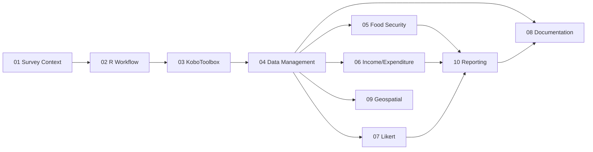
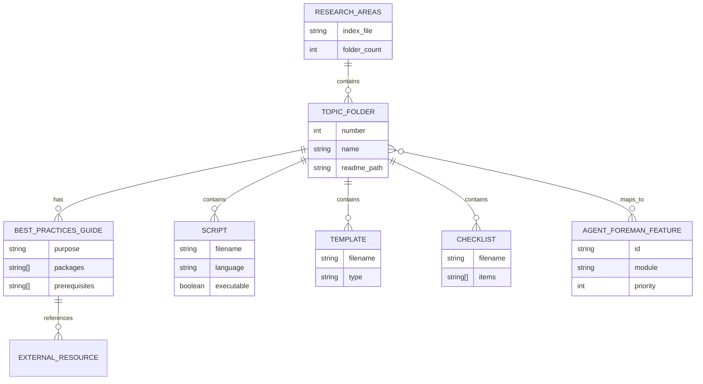

# feat: Reorganize Research Areas into Executable Best Practices Guides

## Overview

Transform the current flat research documentation structure (10 area-*.md files) into topic-based folders, each containing a best practices guide with executable directory templates for R-based survey analysis workflows.

**Current State:**
- 10 research area markdown files (area-0 through area-9)
- 1 master research guide (r-survey-food-security-research-analysis.md)
- Agent-foreman harness with 29 features
- All documentation in flat structure

**Target State:**
- 10 topic-based folders with consistent internal structure
- Each folder contains: best practices guide, executable templates, examples
- Master index linking all areas
- Integration with agent-foreman feature workflow

---

## Problem Statement / Motivation

**Why this matters:**

1. **Discoverability**: Flat file structure makes it hard to find related content
2. **Actionability**: Research docs contain knowledge but no execution path
3. **Workflow Integration**: Current docs don't connect to agent-foreman features
4. **Reproducibility**: No templates for applying research to actual analysis

**User Need:** Convert research knowledge into actionable, reproducible workflows that can be executed for the Vietnam food security survey analysis project.

---

## Proposed Solution

### Phase 1: Folder Structure Creation

Create 10 topic folders following PARA + Johnny Decimal hybrid:

```
research-areas/
├── 00-index.md                          # Master navigation
├── 01-survey-context/                   # Area 0: Understanding
│   ├── README.md                        # Best practices guide
│   ├── area-0-survey-context-understanding.md  # Original doc
│   ├── checklists/
│   │   └── survey-review-checklist.md
│   └── templates/
│       └── construct-mapping-template.md
├── 02-r-workflow/                       # Area 1: R packages
│   ├── README.md
│   ├── area-1-r-workflow-survey-analysis.md
│   ├── scripts/
│   │   └── setup-packages.R
│   └── templates/
│       └── analysis-script-template.R
├── 03-kobo-xlsform/                     # Area 2: Data structure
│   ├── README.md
│   ├── area-2-kobo-xlsform-structure.md
│   └── templates/
│       └── xlsform-documentation-template.md
├── 04-data-management/                  # Area 3: Raw data
│   ├── README.md
│   ├── area-3-raw-data-management.md
│   └── templates/
│       └── data-cleaning-log-template.md
├── 05-food-security-indicators/         # Area 4: HDDS, FIES, etc.
│   ├── README.md
│   ├── area-4-food-security-indicators.md
│   ├── scripts/
│   │   ├── calculate-hdds.R
│   │   ├── calculate-fcs.R
│   │   └── calculate-rcsi.R
│   └── templates/
│       └── indicator-results-template.md
├── 06-income-expenditure/               # Area 5: Vietnam economics
│   ├── README.md
│   ├── area-5-income-expenditure-vietnam.md
│   └── templates/
│       └── expenditure-analysis-template.md
├── 07-likert-psychometrics/             # Area 6: Scale analysis
│   ├── README.md
│   ├── area-6-likert-scales-psychometrics.md
│   └── scripts/
│       └── reliability-analysis.R
├── 08-documentation-standards/          # Area 7: Codebooks
│   ├── README.md
│   ├── area-7-documentation-standards.md
│   └── templates/
│       ├── codebook-template.md
│       ├── data-dictionary-template.md
│       └── survey-appendix-template.md
├── 09-geospatial/                       # Area 8: Mapping
│   ├── README.md
│   ├── area-8-geospatial-analysis.md
│   └── scripts/
│       └── choropleth-map-template.R
└── 10-reporting/                        # Area 9: Tables & export
    ├── README.md
    ├── area-9-descriptives-reporting.md
    └── templates/
        └── gtsummary-table-template.R
```

### Phase 2: Best Practices Guide Template

Each README.md follows this structure:

```markdown
# [Topic Name] Best Practices Guide

## Quick Reference
- **Purpose**: [One sentence]
- **Key Packages**: [List]
- **Related Areas**: [Links to other areas]
- **Agent-Foreman Features**: [Feature IDs]

## Prerequisites
- [ ] Required packages installed
- [ ] Data files available
- [ ] Previous areas completed (if applicable)

## Core Workflow

### Step 1: [Action]
[Description with code example]

### Step 2: [Action]
[Description with code example]

## Checklists

### Before Starting
- [ ] Item 1
- [ ] Item 2

### Quality Assurance
- [ ] Item 1
- [ ] Item 2

## Common Pitfalls
1. **Pitfall**: [Description] → **Solution**: [Fix]

## Templates
- `templates/[name].md` - [Description]

## Scripts
- `scripts/[name].R` - [Description]

## External Resources
- [Resource Name](URL) - [Description]

## Related Areas
- [Area Name](../XX-area-name/) - [Relationship]
```

### Phase 3: Executable Components

**Definition of "Executable":**
- R script templates with placeholder comments
- Runnable examples with sample data patterns
- Checklists that can be copied and tracked
- Directory templates that can be instantiated for new analyses

**Per-folder executable components:**

| Folder | Scripts | Templates | Checklists |
|--------|---------|-----------|------------|
| 01-survey-context | - | construct-mapping | survey-review |
| 02-r-workflow | setup-packages.R | analysis-script | package-check |
| 03-kobo-xlsform | - | xlsform-doc | xlsform-review |
| 04-data-management | - | cleaning-log | data-quality |
| 05-food-security | hdds.R, fcs.R, rcsi.R | indicator-results | indicator-calc |
| 06-income-expenditure | - | expenditure-analysis | outlier-check |
| 07-likert | reliability.R | - | scale-validation |
| 08-documentation | - | codebook, data-dict, appendix | doc-completeness |
| 09-geospatial | choropleth.R | - | map-review |
| 10-reporting | - | gtsummary-table | report-checklist |

### Phase 4: Master Index & Cross-References

Create `00-index.md` as navigation hub:

```markdown
# Research Areas Index

## Quick Navigation

| # | Area | Purpose | Key Features |
|---|------|---------|--------------|
| 01 | [Survey Context](01-survey-context/) | Understanding survey intent | - |
| 02 | [R Workflow](02-r-workflow/) | Package ecosystem | core.* |
| 03 | [KoboToolbox](03-kobo-xlsform/) | Data structure | data-import.* |
| ... | ... | ... | ... |

## Workflow Order



## Cross-Cutting Topics

| Topic | Appears In |
|-------|------------|
| Survey weighting | 02, 05, 09, 10 |
| Missing data | 03, 04 |
| Vietnam context | 01, 05, 06, 09 |
```

### Phase 5: Agent-Foreman Integration

**Option A (Recommended):** Add reorganization as prerequisite features

```json
{
  "id": "docs.reorganize-research-areas",
  "description": "Reorganize research docs into topic folders",
  "module": "docs",
  "priority": 5,
  "status": "failing"
}
```

**Feature mapping to research areas:**

| Research Area | Agent-Foreman Features |
|---------------|------------------------|
| 02-r-workflow | core.* |
| 03-kobo-xlsform | data-import.kobo.*, data-import.xlsform.* |
| 04-data-management | data-cleaning.* |
| 05-food-security | indicators.* |
| 06-income-expenditure | economics.* |
| 07-likert | likert.* |
| 08-documentation | documentation.* |
| 09-geospatial | geospatial.* |
| 10-reporting | reporting.* |

---

## Technical Approach

### File Operations

1. **Create folder structure** (idempotent)
2. **Move original area files** (git mv for history)
3. **Generate README templates** (per folder)
4. **Create placeholder scripts/templates**
5. **Update master guide** → becomes 00-index.md
6. **Update cross-references**

### Git Strategy

```bash
# Create feature branch
git checkout -b feat/reorganize-research-areas

# Atomic commits per phase
git commit -m "feat(docs): create research-areas folder structure"
git commit -m "feat(docs): migrate area files to topic folders"
git commit -m "feat(docs): add best practices guide templates"
git commit -m "feat(docs): add executable scripts and templates"
git commit -m "feat(docs): create master index and cross-references"
```

### Naming Conventions

- **Folders**: `XX-topic-name/` (numbered for sort order)
- **Guides**: `README.md` (standard entry point)
- **Scripts**: `verb-noun.R` (e.g., `calculate-hdds.R`)
- **Templates**: `noun-template.md` or `noun-template.R`
- **Checklists**: `noun-checklist.md`

---

## Acceptance Criteria

### Functional Requirements

- [ ] All 10 research area folders created with consistent structure
- [ ] All original area-*.md files moved to appropriate folders
- [ ] Each folder has README.md best practices guide
- [ ] Executable scripts created for areas with code examples
- [ ] Templates created for documentation deliverables
- [ ] Master index (00-index.md) links all areas correctly
- [ ] Cross-references updated (no broken links)

### Non-Functional Requirements

- [ ] Git history preserved for moved files
- [ ] Naming follows LIBRARY zone conventions (lowercase, hyphens)
- [ ] Structure is idempotent (can re-run without duplication)
- [ ] Compatible with Obsidian vault symlinks

### Quality Gates

- [ ] All markdown files pass linting
- [ ] No orphaned files in root directory
- [ ] Agent-foreman feature list updated if needed
- [ ] User review and approval of structure

---

## Implementation Phases

### Phase 1: Structure Creation
**Tasks:**
1. Create `research-areas/` directory
2. Create 10 numbered topic folders
3. Create `00-index.md` placeholder
4. Create internal folder structure (scripts/, templates/, checklists/)

**Deliverable:** Empty folder structure ready for content

### Phase 2: Content Migration
**Tasks:**
1. Move area-0 through area-9 files using `git mv`
2. Update any internal links within moved files
3. Verify git history preserved

**Deliverable:** All original docs in new locations

### Phase 3: Guide Generation
**Tasks:**
1. Create README.md template
2. Generate README.md for each folder
3. Populate with content extracted from area docs
4. Add checklist sections

**Deliverable:** 10 best practices guides

### Phase 4: Executable Components
**Tasks:**
1. Create R script templates for relevant areas
2. Create markdown templates for documentation
3. Create checklists for quality assurance
4. Add placeholder comments with instructions

**Deliverable:** Runnable templates and checklists

### Phase 5: Integration & Validation
**Tasks:**
1. Create master 00-index.md with navigation
2. Update/deprecate original master guide
3. Update agent-foreman feature references
4. Validate all links work
5. User acceptance testing

**Deliverable:** Complete, validated structure

---

## Risk Analysis & Mitigation

| Risk | Likelihood | Impact | Mitigation |
|------|------------|--------|------------|
| Broken cross-references | High | Medium | Automated link checking before commit |
| Git history loss | Medium | High | Use `git mv`, verify with `git log --follow` |
| Obsidian sync issues | Medium | Medium | Test symlink compatibility before finalizing |
| Scope creep (adding content) | High | Low | Strict phase boundaries, structure-only first |
| Agent-foreman conflicts | Low | Medium | Review feature list before modifying |

---

## Dependencies & Prerequisites

**Before starting:**
- [ ] Git working directory clean
- [ ] No pending agent-foreman features in progress
- [ ] Backup of current state (or trust git)

**External dependencies:**
- None (pure documentation reorganization)

---

## Future Considerations

1. **Auto-generation**: Could script README generation from area doc headers
2. **CI/CD**: Link checking in pre-commit hook
3. **Obsidian integration**: Create MOC (Map of Content) for vault
4. **Template instantiation**: Script to copy template folder for new analyses

---

## References & Research

### Internal References
- `ai/feature_list.json` - Current 29 features organized by module
- `r-survey-food-security-research-analysis.md` - Master research guide
- `area-0-survey-context-understanding.md:1-189` - Survey context docs
- `CLAUDE.md` - Zone model and naming conventions

### External References
- [PARA Method](https://fortelabs.com/blog/para/) - Actionability-based organization
- [Johnny Decimal](https://johnnydecimal.com/) - Numerical folder organization
- [README-Driven Development](https://tom.preston-werner.com/2010/08/23/readme-driven-development.html) - Documentation-first approach
- [Tidy Survey Book](https://tidy-survey-r.github.io/tidy-survey-book/) - R survey analysis patterns

### Research Agents Used
- repo-research-analyst: Project structure analysis
- best-practices-researcher: Organization patterns
- framework-docs-researcher: Markdown/PKM systems
- spec-flow-analyzer: Gap identification

---

## Open Questions (Require User Input)

1. **Location**: Should `research-areas/` live in project root or under a parent folder?
2. **Master guide fate**: Keep `r-survey-food-security-research-analysis.md` as reference or merge into index?
3. **Script completeness**: Full working scripts or template stubs?
4. **Agent-foreman**: Add documentation features to feature_list.json?

---

## ERD: Research Area Relationships



---

*Generated with Claude Code*
