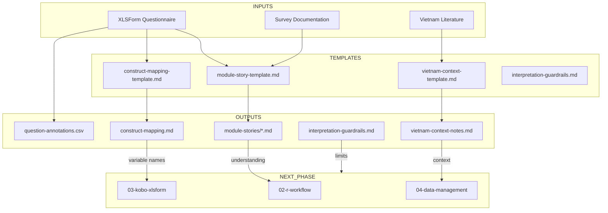

# Plan: Transform 01-survey-context into Executable Workspace

**Type:** Enhancement
**Priority:** High
**Effort:** ~2 hours

---

## Overview

Transform the `01-survey-context/` folder from a conceptual reference guide into a **fully executable workspace** where each step produces concrete output files that feed into the analysis pipeline.

## Current State

```
01-survey-context/
├── README.md                              # Best practices guide (conceptual)
├── area-0-survey-context-understanding.md # Original research guide
├── checklists/
│   └── survey-review-checklist.md         # Empty checklist (no tracking)
└── templates/
    └── construct-mapping-template.md      # Blank template
```

**Problems:**
1. No working directory for actual outputs
2. Templates are generic - not pre-filled for Vietnam food security
3. No progression tracking mechanism
4. Missing key output templates (context notes, guardrails, module stories)
5. No clear "done" state

## Proposed Structure

```
01-survey-context/
├── README.md                              # Updated: execution instructions
├── area-0-survey-context-understanding.md # Reference (unchanged)
├── 00-PROGRESS.md                         # NEW: Execution tracker
├── checklists/
│   └── survey-review-checklist.md         # Updated: with progress tracking
├── templates/                             # Blank templates for copying
│   ├── construct-mapping-template.md
│   ├── module-story-template.md           # NEW
│   ├── vietnam-context-template.md        # NEW
│   └── interpretation-guardrails.md       # NEW
└── outputs/                               # NEW: Your completed work
    ├── .gitkeep
    ├── construct-mapping.md               # Filled from template
    ├── module-stories/                    # One per survey module
    │   ├── 01-demographics.md
    │   ├── 02-food-consumption.md
    │   └── ...
    ├── vietnam-context-notes.md           # Your context research
    ├── interpretation-guardrails.md       # Your analysis limits
    └── question-annotations.csv           # Question-level notes
```

## Implementation Phases

### Phase 1: Create Directory Structure
Create `outputs/` directory with subdirectories.

**Files:**
- `outputs/.gitkeep`
- `outputs/module-stories/.gitkeep`

### Phase 2: Create Progress Tracker
New file `00-PROGRESS.md` that tracks execution state.

**Content:**
```markdown
# Survey Context - Progress Tracker

## Quick Status
- [ ] Phase 1: Survey Intent (0/5 modules)
- [ ] Phase 2: Question Analysis (0/X questions)
- [ ] Phase 3: Vietnam Context
- [ ] Phase 4: Construct Mapping
- [ ] Phase 5: Interpretation Limits

## Current Step
> **Next:** Read XLSForm and start module stories

## Completed Outputs
| Output | Status | Date |
|--------|--------|------|
| Module stories | Not started | |
| Construct map | Not started | |
| Context notes | Not started | |
| Guardrails | Not started | |
```

### Phase 3: Create New Templates

#### `templates/module-story-template.md`
Pre-structured template for documenting each survey module:

```markdown
# Module Story: [Module Name]

## Purpose
This module captures **[WHAT]** because **[WHY]**, and feeds into **[WHICH INDICATORS]**.

## Questions Included
| Q# | Variable | Concept | Notes |
|----|----------|---------|-------|
| | | | |

## Key Skip Logic
- Shown when: `[relevant expression]`
- Structural NA when: `[condition]`

## Weaknesses/Biases
- [ ] Recall bias:
- [ ] Social desirability:
- [ ] Translation issues:

## How This Feeds Analysis
→ Used in: [indicator calculation script]
→ Transformation: [sum/mean/categorize]
```

#### `templates/vietnam-context-template.md`
Structured template for context research:

```markdown
# Vietnam Context Notes

## Food Environment & Diets
### Typical Diets in Study Area
- Staples:
- Proteins:
- Vegetables:

### Seasonality
- Survey period: [month/year]
- Season characteristics: [wet/dry, harvest, lean]
- Normal or special period?:

## Food Waste Context
### Cultural Attitudes
-

### Local Practices
- Leftovers:
- Animal feeding:
- Composting:

## Economic Context
### Income Sources
| Type | Common? | Notes |
|------|---------|-------|
| Formal employment | | |
| Agriculture | | |
| Remittances | | |
| Informal | | |

### Money Talk
- Usual period: [weekly/monthly]
- Cash vs in-kind:

### Poverty Benchmarks
- National line (2023): 3.4%
- Study area estimate:
- WB thresholds applied: $2.15 / $3.65 / $6.85

## Key Literature Notes
| Study | Finding | Relevance |
|-------|---------|-----------|
| | | |

## Sources
- [ ] GSO VHLSS 2022
- [ ] UNU-WIDER VARHS
- [ ] [Other sources]
```

#### `templates/interpretation-guardrails.md`
Template for documenting analysis limits:

```markdown
# Interpretation Guardrails

Keep this list in front of you while analyzing and writing.

## What This Survey CAN Tell You
- [ ]

## What This Survey CANNOT Tell You
- [ ] Causality (cross-sectional limitation)
- [ ]

## Biases to Watch For
| Bias | Affected Questions | Mitigation |
|------|-------------------|------------|
| Social desirability | | Acknowledge in limitations |
| Recall | | |
| Gender dynamics | | Document respondent role |

## Over-interpretation Risks
- [ ] Don't interpret small HDDS differences as health outcomes
- [ ] Food waste self-reports likely underestimate true waste
- [ ]

## Population Exclusions
Who is NOT represented in this sample?
- [ ]
```

### Phase 4: Update README.md
Rewrite as execution guide with clear steps and file references.

**New sections:**
- "How to Execute This Workspace"
- Step-by-step with file creation commands
- Clear "Definition of Done"

### Phase 5: Create Question Annotations Template
CSV template for systematic question review:

```csv
question_id,variable_name,module,concept_measured,assumptions,weaknesses,recall_period,reverse_code,notes
Q1,hh_size,Demographics,Household composition,Clear definition,None,Current,No,
```

## Acceptance Criteria

### Functional
- [ ] `outputs/` directory exists with `.gitkeep`
- [ ] `00-PROGRESS.md` tracks execution state
- [ ] All 4 new templates created
- [ ] README updated with execution instructions
- [ ] Question annotations CSV template exists

### Quality Gates
- [ ] Templates are pre-filled with Vietnam food security examples
- [ ] Clear "done" criteria defined for each step
- [ ] Cross-references to WORKFLOW.md for next phase

## Definition of Done

When this workspace is complete, you should have:

1. **Module Stories** (`outputs/module-stories/*.md`)
   - One file per survey module
   - Each explains what/why/feeds-into

2. **Construct Map** (`outputs/construct-mapping.md`)
   - Complete table linking constructs to questions
   - Transformations documented

3. **Vietnam Context** (`outputs/vietnam-context-notes.md`)
   - 1-2 pages of context research
   - Literature references

4. **Guardrails** (`outputs/interpretation-guardrails.md`)
   - List of what you can/cannot conclude
   - Biases acknowledged

5. **Question Annotations** (`outputs/question-annotations.csv`)
   - Every question reviewed
   - Concepts and risks noted

---

## ERD: Workspace Data Flow



---

*Plan created: 2025-12-10*
